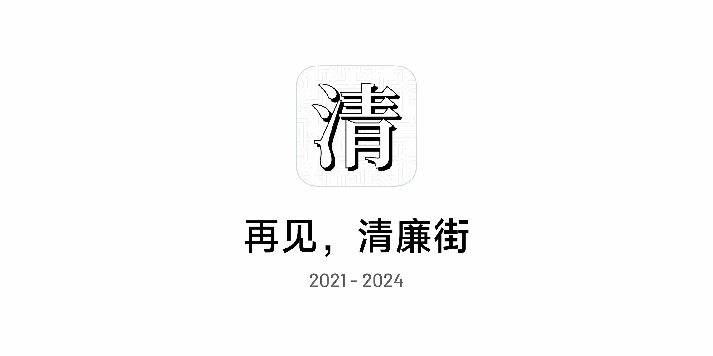
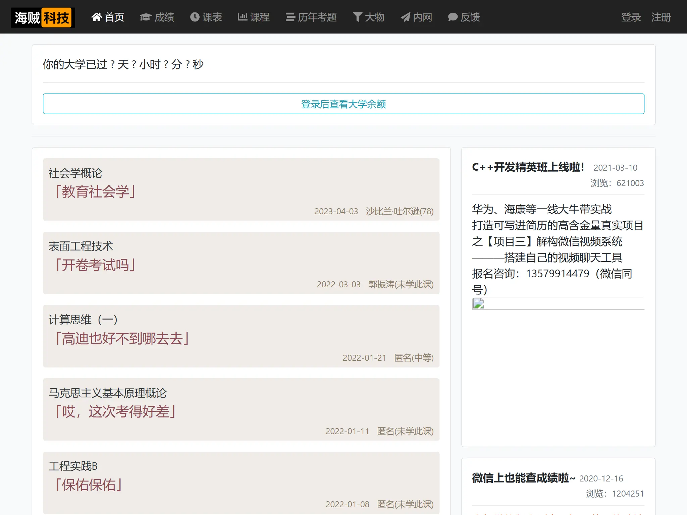
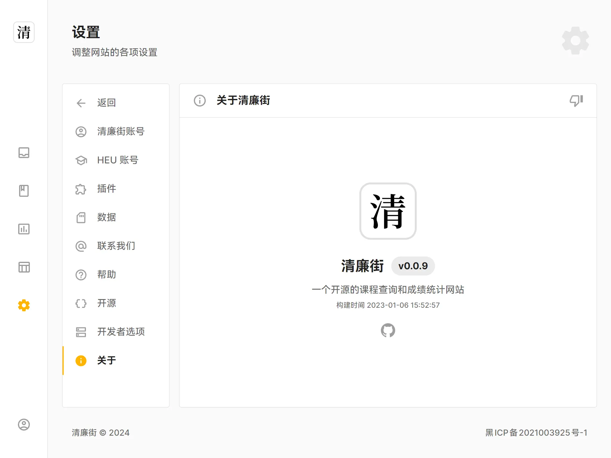
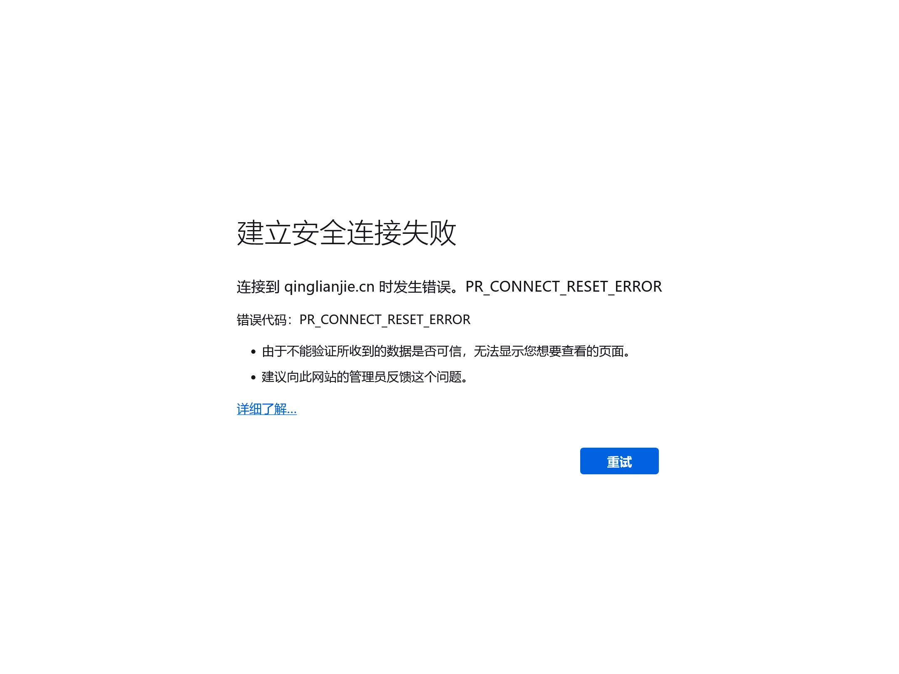

 

# 清廉街 <mark>不再维护</mark>

> 👋 好久不见

你可能已经注意到了，清廉街网站已经有一段时间无法访问了。

由于负责清廉街开发的同学时间精力不足、学校网站改版、缺少测试账号等原因，清廉街已经很久没有维护了，**我们决定，不再提供课程查询、成绩查询、课程评论等功能**，原来的网站将会下线，你可以在现在这个网站找到清廉街的「遗迹」。

最后，要感谢大家一直以来的支持和建议，感谢参与清廉街项目开发的各位小伙伴，也要感谢无数的开源软件和开源贡献者，希望清廉街这个网站帮到过大家。

## 过去

事情的开始要从「[腐败街](https://www.fubaijie.cn)」说起。在大概 2019-2020 年左右，当时学校教务网站并不好用，而且也不好看，后来某位大佬开发了腐败街网站（这个名字起的很好，来源于校内一个已经成为历史的小吃街），可以实现从教务网站抓取和整理数据，并提供了课程评论的功能。

> <small>🫡 2024 年的腐败街网站</small>

清廉街项目始于 2021 年，清廉街网站的出现是因为腐败街网站加入了广告，而且也没有开源，在账号数据的储存和使用上并不透明，我们希望做一个新的网站，可以解决这些问题，帮助同学们更方便地查成绩和课程信息，所以就有了「[清廉街](https://qinglianjie.cn)」这个网站。

再后来，时间来到 2022 年，负责清廉街开发和维护的同学大部分已经陆续毕业，走入社会，因工作繁忙和需要处理的事务较多，没有足够的时间进行「[测试版](https://dev.qinglianjie.cn/)」的开发工作，导致了项目的停滞。

> <small>🎉 清廉街未完成的测试版</small>

2023 年初，经过同学们的反馈，我们发现学校上线了新版的教务网站，清廉街原有获取数据的方式（爬虫解析页面）已经无法兼容，同时由于负责开发的同学已经毕业，无法登录新版教务网站。至此，清廉街的课程和成绩数据获取功能已经基本无法使用，但课程评论和历史成绩查询功能还能勉强使用，但也没有进一步维护。

时间来到了 2024 年，很多曾经使用过清廉街的同学可能会发现，清廉街的网站已经打不开了，属于「年久失修」了，但我们还没有放弃这个网站。

> <small>🚧 打不开的清廉街网站</small>

2024 年初，经过内部讨论，我们决定放弃维护清廉街原有的成绩、课程查询等功能。

清廉街的大部分历史代码都可以在我们的 [GitHub 主页](https://github.com/QingLianJie) 中找到，我们希望越来越多同学可以对软件开发感兴趣，也希望有更多的同学可以参与到开源软件的建设中来。

## 未来

如果不出意外，清廉街网站将以你现在看到的文档的形式存在，不会再有成绩查询等功能，这样可以节约运维成本，让这个网站可以存在更长时间。

 

> 清廉街开发者
>
> <small>❤️ 写于 2024 年 8 月 2 日晚</small>
